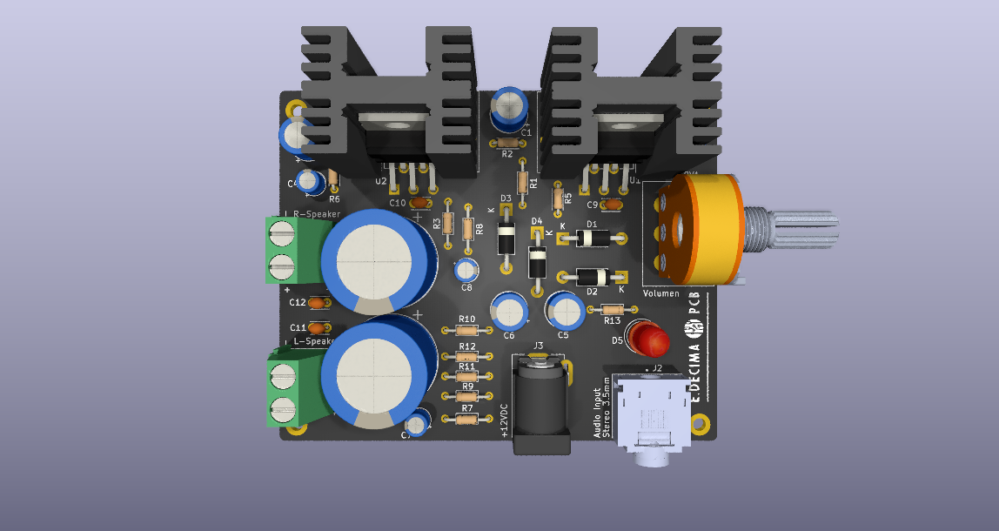
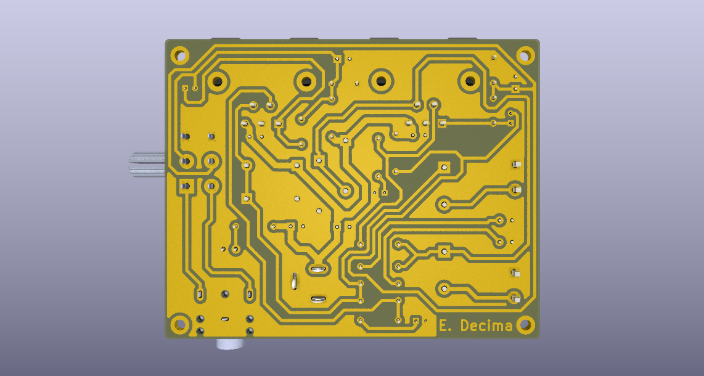

# Amplificador Estéreo TDA2030  
   

## Descripción  
Este proyecto es un **amplificador estéreo basado en el integrado TDA2030**, diseñado para ofrecer una solución compacta y de buen desempeño para aplicaciones de audio Hi-Fi, educación y prototipado. El diseño incluye PCB, esquemático, lista de materiales y archivos listos para fabricación.

## 🔧 Características principales  
- Dos canales de audio (izquierda y derecha) utilizando TDA2030 en configuración típica.  
- Diseño de PCB simple faz, con huella optimizada para montaje a través de orificio (THT).
- Fuente de alimentación simple (recomendado 12VDC).
- Listado de materiales (BOM) incluido en formatos PDF y XLS.  
- Archivos de fabricación (Gerbers, ficheros KiCad) incluidos.  
- Ideal para amplificación de señal de línea, sistemas de escritorio, audio doméstico o proyecto educativo.

## 🖼️ Esquema y PCB  
*(Insertar imágenes aquí para visualización rápida)*  
  
  

## ⚙️ Documentación técnica  
### Arquitectura general  
El amplificador emplea dos unidades TDA2030, una por canal, en configuración con decouplado de alimentación, filtro de entrada y componentes de realimentación para ganancia moderada (~20–30x).  
Se dispone de conectores de entrada de audio de línea, potenciometro/selector de ganancia, y salidas de altavoz de 4 Ω-8 Ω.

### Consideraciones de diseño  
- Se recomienda usar disipadores térmicos en los TDA2030 si la potencia exigida es alta.
- La entrada de audio debe ser preamplificada anteriormente hasta el voltaje de linea 1Vrms.

## 🧰 Requisitos y compatibilidad  
### Requisitos  
- Fuente de alimentación de 12V-DC.
- Altavoces de impedancia 4Ω o 8Ω.  
- Señal de entrada de nivel de línea 1Vrms.  
- Habilidades básicas de soldadura para montaje THT.

### Compatibilidad  
Este diseño está pensado para montaje en ambiente “hobby/prototipo” y también escalable para proyectos de audio doméstico o educativo.

## 💻 Ejemplo de uso  
1. Montar la PCB según el archivo de montaje y la lista de materiales.  
2. Conectar la alimentación y verificar tensiones (sin señal).  
3. Conectar entrada y altavoces.  
4. Aplicar señal de audio de línea, ajustar volumen, y comprobar ganancia, distorsión y estabilidad.  
5. Ajustar según necesidades (por ejemplo añadir filtro de paso bajo, control de volumen, etc).

## 👤 Autor  
Diseñado por Emanuel Décima  
📅 Fecha de última actualización: Noviembre 2025  
📧 Contacto: emanueldecima3@gmail.com

